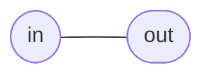

# Wire

**Difficulty:** ⭐ (Getting started) · **Topics:** modules, ports, `assign`, the `logic` type

## Background
Hardware description languages describe *structure and behaviour of circuits*,
not a program that runs top-to-bottom. The basic unit is a **module**: a block
with a name, a list of **ports** (its inputs and outputs), and a body that says
how the outputs relate to the inputs.

The simplest possible circuit is a plain **wire** that carries a value from one
place to another. In SystemVerilog we describe a permanent connection with a
**continuous assignment**, written with the `assign` keyword. "Continuous" means
it is always in effect — any time the input changes, the output follows
immediately, exactly like a real wire. This is different from a `begin ... end`
procedural block (which we will meet later for registers).

## The task
Build a module called `wire_passthrough` whose output `out` always equals its
input `in`.

## Interface
| Port | Dir | Width | Description |
|------|-----|-------|-------------|
| `in`  | input  | 1 | source signal |
| `out` | output | 1 | copy of `in` |



## How to approach it
1. The `module wire_passthrough ( ... );` header and its ports are already given
   to you in `interface.sv` — you only fill in the body.
2. A wire is a *continuous* connection, so use `assign` (not an `always` block).
3. Drive the output from the input:
   ```systemverilog
   assign out = in;
   ```
That single line is the whole circuit.

## Worked example
| time | in | out |
|------|----|-----|
| 0 ns | 0 | 0 |
| 5 ns | 1 | 1 |
| 10 ns| 0 | 0 |

`out` mirrors `in` with (ideally) zero delay.

## Common mistakes
- Writing `out = in;` **without** `assign` at module level — that is a syntax
  error; continuous assignments need the `assign` keyword.
- Trying to use an `always` block for a pure wire — it works but is overkill and
  obscures the intent. Reserve procedural blocks for logic that needs them.
- Declaring `out` as something that cannot be continuously driven — with the
  `logic` type this is not a problem (see notes).

## SystemVerilog notes
`logic` is a 4-state type (values `0`, `1`, `x` (unknown), `z` (high-impedance))
and it can be driven by **either** a continuous `assign` **or** a procedural
block. That is why modern SystemVerilog uses `logic` almost everywhere and you
rarely need the older `wire`/`reg` keywords.

## Run it
```bash
# from track/verilog_zero2hero/
iverilog -g2012 -s tb -o sim 0000/tb.sv 0000/solution.sv && vvp sim
```
You should see `Test PASS`. Swap `solution.sv` for `interface.sv` to test your
own answer.
