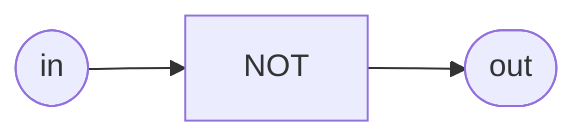

# Inverter (NOT)

**Difficulty:** ⭐ · **Topics:** bitwise NOT

## Learning objective
Your first logic function: invert a bit.

## Problem
Build `not_gate` where `out = NOT in`.

## Interface
| Port | Dir | Width | Description |
|------|-----|-------|-------------|
| `in`  | input  | 1 | source |
| `out` | output | 1 | inverted source |

## Truth table
| in | out |
|----|-----|
| 0  | 1   |
| 1  | 0   |

## Hints
- The bitwise NOT operator is `~`.
