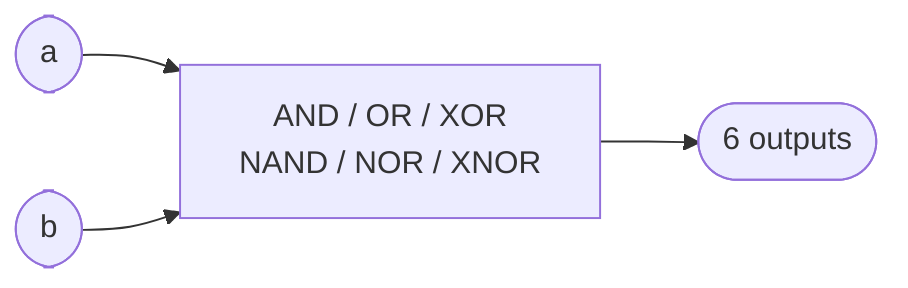

# Basic logic gates

**Difficulty:** ⭐ · **Topics:** bitwise operators, multiple outputs

## Learning objective
Compute several boolean functions of two inputs in one module.

## Problem
Given inputs `a` and `b`, produce the six basic gate results.

## Interface
| Port | Dir | Width | Function |
|------|-----|-------|----------|
| `a`, `b`   | input  | 1 | operands |
| `y_and`    | output | 1 | a AND b |
| `y_or`     | output | 1 | a OR b |
| `y_xor`    | output | 1 | a XOR b |
| `y_nand`   | output | 1 | a NAND b |
| `y_nor`    | output | 1 | a NOR b |
| `y_xnor`   | output | 1 | a XNOR b |

## Hints
- Operators: `&` `|` `^`, and their negations `~(...)`.
