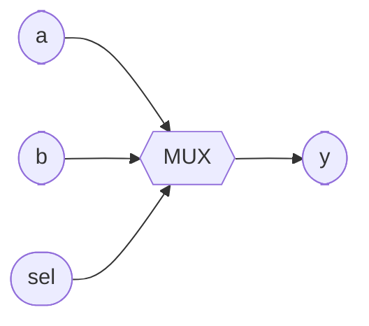

# 2-to-1 Multiplexer

**Difficulty:** ⭐⭐ · **Topics:** conditional operator, selection

## Background
A **multiplexer** ("mux") is a controlled switch: a select signal chooses which
of several inputs reaches the output. It is the single most common building
block in a datapath — every "choose A or B" decision is a mux.

The 2-to-1 mux has two data inputs and one select bit:
- `sel = 0` → output = `a`
- `sel = 1` → output = `b`

The cleanest way to write it is the **conditional (ternary) operator**
`cond ? value_if_true : value_if_false`.

## The task
Build `mux2to1`.

## Interface
| Port | Dir | Width | Description |
|------|-----|-------|-------------|
| `a`   | input  | 1 | data 0 |
| `b`   | input  | 1 | data 1 |
| `sel` | input  | 1 | select |
| `y`   | output | 1 | selected data |



## Truth table
| sel | y |
|-----|---|
| 0   | a |
| 1   | b |

## How to approach it
```systemverilog
assign y = sel ? b : a;
```
Read it as: "if `sel` then `b`, else `a`". Note the order — the *true* branch (`sel=1`)
gives `b`.

## Common mistakes
- Swapping the branches (`sel ? a : b`) and selecting the wrong input.
- Overthinking it with an `always`/`case` block — perfectly valid, but the
  ternary is the idiomatic one-liner for a 2:1 mux.

## SystemVerilog notes
The ternary works on vectors too, so the same pattern widens to a bus mux:
`assign y = sel ? b_bus : a_bus;`. Chaining ternaries builds larger muxes, though
a `case` inside `always_comb` is clearer past 2 inputs (see problem 0013).

## Run it
```bash
iverilog -g2012 -s tb -o sim 0004/tb.sv 0004/solution.sv && vvp sim
```
