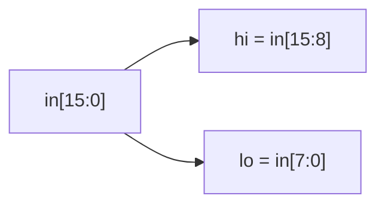

# Vector split

**Difficulty:** ⭐ · **Topics:** vectors, bit-slicing, `logic [N-1:0]`

## Learning objective
Declare a multi-bit vector and pull out sub-fields with the part-select `[hi:lo]`.

## Problem
Split a 16-bit word into its upper and lower bytes.

## Interface
| Port | Dir | Width | Description |
|------|-----|-------|-------------|
| `in` | input  | 16 | packed word |
| `hi` | output | 8  | `in[15:8]` |
| `lo` | output | 8  | `in[7:0]` |

## Hints
- A constant part-select `in[15:8]` returns 8 bits.
