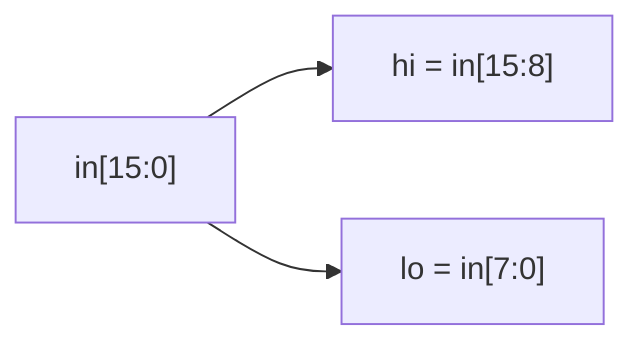

# Vector split

**Difficulty:** ⭐ · **Topics:** vectors, bit-slicing, `logic [N-1:0]`

## Background
A **vector** is a bundle of wires treated as one multi-bit signal, declared with
a range: `logic [15:0] d;` is 16 bits, numbered 15 (MSB) down to 0 (LSB). You can
grab a contiguous run of bits with a **part-select** `d[hi:lo]`, which yields
`hi-lo+1` bits. Splitting a wide word into fields is one of the most common
things you do in RTL (think: an address into tag/index/offset).

## The task
Split a 16-bit word into its upper and lower bytes.

## Interface
| Port | Dir | Width | Description |
|------|-----|-------|-------------|
| `in` | input  | 16 | packed word |
| `hi` | output | 8  | `in[15:8]` |
| `lo` | output | 8  | `in[7:0]` |



## How to approach it
```systemverilog
assign hi = in[15:8];
assign lo = in[7:0];
```

## Worked example
`in = 16'hABCD` → `hi = 8'hAB`, `lo = 8'hCD`.

## Common mistakes
- Reversed range (`in[8:15]`) — the high index must come first for a `[hi:lo]`
  descending vector.
- Width mismatch: `hi` is 8 bits, so it must be assigned an 8-bit slice.

## SystemVerilog notes
For a *variable* start position use the indexed part-select `in[base +: 8]`
(8 bits starting at `base`, going up) or `in[top -: 8]` (going down). Constant
`[hi:lo]` is enough here.

## Run it
```bash
iverilog -g2012 -s tb -o sim 0005/tb.sv 0005/solution.sv && vvp sim
```
