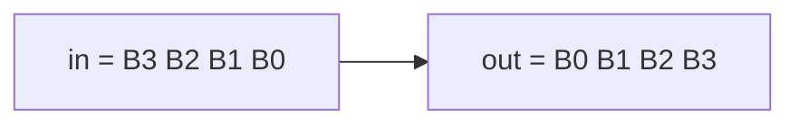

# Byte reverse (unpacked arrays)

**Difficulty:** ⭐⭐ · **Topics:** packed vs unpacked arrays, byte addressing

## Background
SystemVerilog has two flavours of array:
- **Packed** (`logic [31:0] w`): one contiguous bit-vector. You can do arithmetic
  on it and slice it. Dimensions go *before* the name.
- **Unpacked** (`logic [7:0] b [4]`): a collection of separate elements, like four
  little registers or a small memory. Dimensions go *after* the name.

Here you use a short unpacked array as scratch storage to reorder bytes. Byte `i`
of a word is `w[i*8 +: 8]` (8 bits starting at bit `i*8`).

## The task
Reverse the **byte** order of a 32-bit word:
`out = {in[7:0], in[15:8], in[23:16], in[31:24]}`.

## Interface
| Port | Dir | Width | Description |
|------|-----|-------|-------------|
| `in`  | input  | 32 | packed word |
| `out` | output | 32 | byte-swapped word |



## How to approach it
1. Split the input into a 4-element unpacked byte array.
2. Write the bytes back in reverse order.
```systemverilog
logic [7:0] b [4];
always_comb begin
    for (int i = 0; i < 4; i++) b[i]          = in[i*8 +: 8];
    for (int i = 0; i < 4; i++) out[i*8 +: 8] = b[3-i];
end
```

## Worked example
`in = 32'h11223344` → `out = 32'h44332211`.

## Common mistakes
- Confusing packed and unpacked syntax (dimensions before vs after the name).
- Mixing up bit-reverse (problem 0008) with byte-reverse — here whole 8-bit
  groups move, their internal bit order stays.

## SystemVerilog notes
Unpacked arrays model memories and register files. Note: some tools (including
the Icarus Verilog used here) do not connect unpacked-array **ports** across
module boundaries, which is why this design keeps the array internal and uses
packed ports.

## Run it
```bash
iverilog -g2012 -s tb -o sim 0009/tb.sv 0009/solution.sv && vvp sim
```
