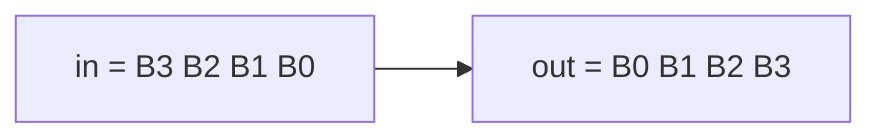

# Byte reverse (unpacked arrays)

**Difficulty:** ⭐⭐ · **Topics:** packed vs unpacked arrays, byte addressing

## Learning objective
Understand the difference between a *packed* vector and an *unpacked* array by
using an unpacked array as internal scratch storage.

## Problem
Reverse the **byte** order of a 32-bit word.
`out` byte 0 is `in` byte 3, byte 1 is byte 2, and so on
(`out = {in[7:0], in[15:8], in[23:16], in[31:24]}`).

## Interface
| Port | Dir | Width | Description |
|------|-----|-------|-------------|
| `in`  | input  | 32 | packed word |
| `out` | output | 32 | byte-swapped word |

## Hints
- Declare an unpacked array `logic [7:0] b [4];` and fill it with `in[i*8 +: 8]`.
- The indexed part-select `x[i*8 +: 8]` selects 8 bits starting at bit `i*8`.

## SystemVerilog notes
Packed dimensions (`logic [7:0] x`) are one contiguous bit-vector you can do
arithmetic on; unpacked dimensions (`logic [7:0] b [4]`) are separate elements,
like hardware registers or a small memory.
