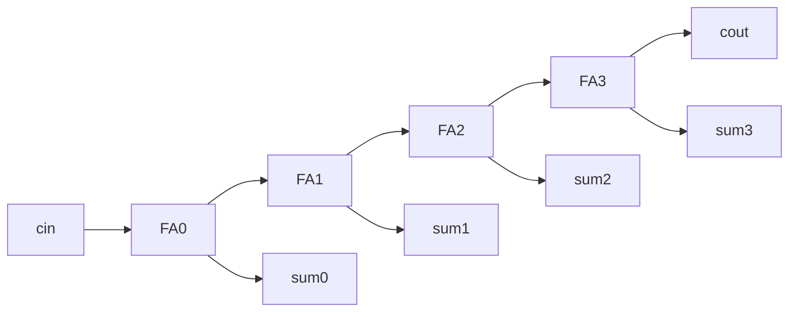

# Ripple-carry adder (generate)

**Difficulty:** ⭐⭐⭐ · **Topics:** `parameter`, `generate`/`genvar`, carry chain

## Background
To add `WIDTH`-bit numbers, chain `WIDTH` full adders: the carry "ripples" from
the LSB stage up to the MSB. Rather than copy-paste stages, use a **`generate`
loop** over a **`genvar`**, which the tool unrolls at elaboration time into that
many stages. The width comes from a **`parameter`**, so one description scales to
any size.

## The task
Add two `WIDTH`-bit numbers plus `cin`, producing `sum` and `cout`, built from a
generated carry chain.

## Interface
| Port | Dir | Width | Description |
|------|-----|-------|-------------|
| `a`, `b` | input  | WIDTH | operands |
| `cin`    | input  | 1     | carry in |
| `sum`    | output | WIDTH | result |
| `cout`   | output | 1     | carry out |

**Parameter:** `WIDTH` (default 4)



## How to approach it
1. Declare an internal carry vector one bit wider than the operands:
   `logic [WIDTH:0] carry;` with `carry[0] = cin` and `cout = carry[WIDTH]`.
2. Generate one full-adder stage per bit:
```systemverilog
genvar i;
generate
    for (i = 0; i < WIDTH; i++) begin : gen_fa
        assign sum[i]     = a[i] ^ b[i] ^ carry[i];
        assign carry[i+1] = (a[i] & b[i]) | (a[i] & carry[i]) | (b[i] & carry[i]);
    end
endgenerate
```

## Common mistakes
- Forgetting the extra carry bit (`carry` must be `WIDTH+1` wide).
- Using a normal `for` (procedural) where a `generate` is intended — for building
  repeated *structure* with `genvar`, use `generate`.

## SystemVerilog notes
`generate` runs at *elaboration* (build) time, so the loop bound must be a
constant/parameter. The named block `gen_fa` gives each stage a hierarchical name
you will see in the waveform.

## Run it
```bash
iverilog -g2012 -s tb -o sim 0012/tb.sv 0012/solution.sv && vvp sim
```
