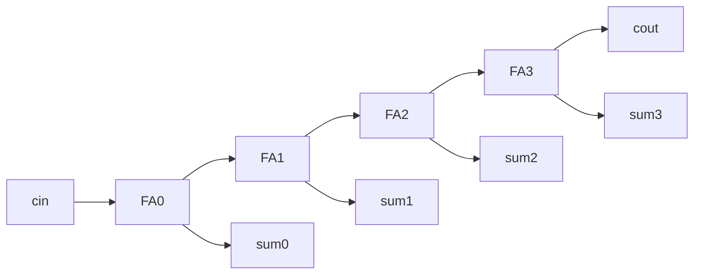

# Ripple-carry adder (generate)

**Difficulty:** ⭐⭐⭐ · **Topics:** `parameter`, `generate`/`genvar`, carry chain

## Learning objective
Build a parameterized adder by *generating* one full-adder stage per bit.

## Problem
Add two `WIDTH`-bit numbers plus a carry-in, producing a `WIDTH`-bit sum and a
carry-out. Use a `generate` `for` loop over a `genvar` to build the carry chain.

## Interface
| Port | Dir | Width | Description |
|------|-----|-------|-------------|
| `a`, `b` | input  | WIDTH | operands |
| `cin`    | input  | 1     | carry in |
| `sum`    | output | WIDTH | result |
| `cout`   | output | 1     | carry out |

**Parameter:** `WIDTH` (default 4)

## Hints
- Keep an internal `logic [WIDTH:0] carry;` with `carry[0]=cin`, `cout=carry[WIDTH]`.
- Inside the generate loop: `sum[i]=a[i]^b[i]^carry[i]` and the majority function
  for `carry[i+1]`.

## SystemVerilog notes
`generate`/`genvar` builds *structure* at elaboration time — the loop count must
be constant. It is the idiomatic way to scale a design by a `parameter`.
