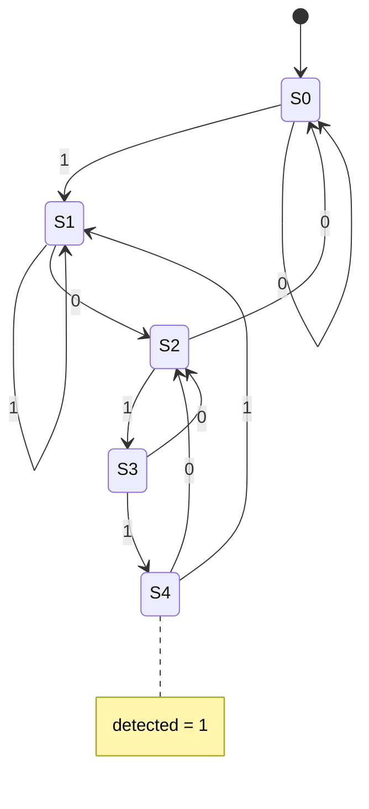

# Sequence detector "1011" (Moore FSM)

**Difficulty:** ⭐⭐⭐⭐ · **Topics:** enum FSM, Moore output, overlapping

## Background
A **finite state machine** remembers "how far along a pattern we are". Each clock
it consumes one input bit and moves between named states; when it reaches the
accepting state, it flags a match. This is a **Moore** machine: the output depends
*only on the current state*, so `detected` is a clean registered signal.

We detect `1011` with **overlap** allowed (so `1011011` fires twice). The trick
for overlap: from the accepting state, the trailing `1` is also the start of a new
potential match.

## The task
Assert `detected` for one cycle whenever the last four serial bits equal `1011`.

## Interface
| Port | Dir | Width | Description |
|------|-----|-------|-------------|
| `clk`, `rst_n` | input | 1 | clock / async reset |
| `din`      | input  | 1 | serial data |
| `detected` | output | 1 | pattern seen |



## How to approach it
1. Name the states (got-nothing, got-`1`, got-`10`, got-`101`, got-`1011`) with an
   `enum`.
2. Register the state in `always_ff` using a `case`.
3. Drive `detected = (state == S4)` combinationally (Moore).
```systemverilog
typedef enum logic [2:0] {S0,S1,S2,S3,S4} state_e;
state_e state;
always_ff @(posedge clk or negedge rst_n)
    if (!rst_n) state <= S0;
    else case (state)
        S0: state <= din ? S1 : S0;
        // ...
        S4: state <= din ? S1 : S2;   // overlap
    endcase
assign detected = (state == S4);
```

## Common mistakes
- Wrong overlap transitions from the accepting state (drop them and `1011011`
  only fires once).
- Making it Mealy by accident (`detected` depending on `din`).

## SystemVerilog notes
An `enum` for states makes the waveform readable (`S3` instead of `3'd3`) and lets
the tool catch illegal assignments.

## Run it
```bash
iverilog -g2012 -s tb -o sim 0028/tb.sv 0028/solution.sv && vvp sim
```
