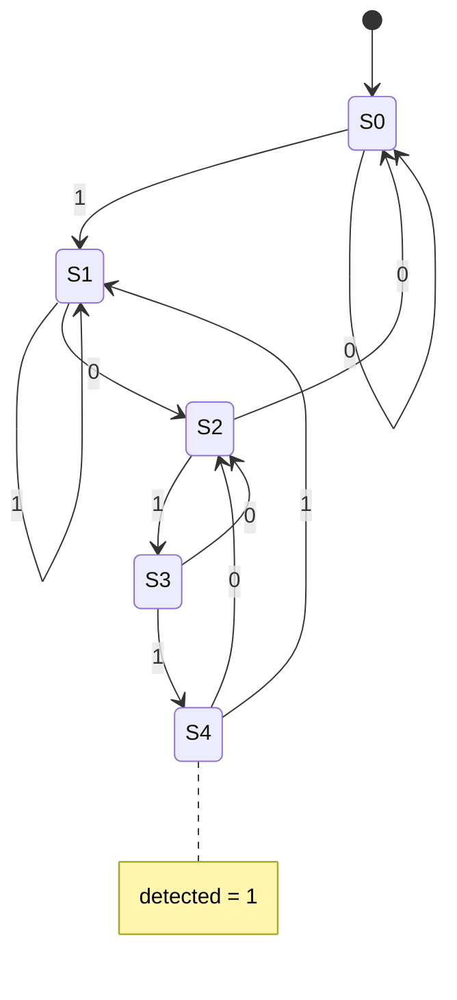

# Sequence detector "1011" (Moore FSM)

**Difficulty:** ⭐⭐⭐⭐ · **Topics:** enum FSM, Moore output, overlapping

## Learning objective
Build a finite state machine with named states that raises `detected` for one
cycle whenever the serial pattern `1011` has just arrived (overlaps allowed).

## Problem
One bit `din` arrives per clock. Assert `detected` in the cycle where the most
recent four bits equal `1011`. This is a **Moore** machine: `detected` depends
only on the current state.

## Interface
| Port | Dir | Width | Description |
|------|-----|-------|-------------|
| `clk`, `rst_n` | input | 1 | clock / async reset |
| `din`      | input  | 1 | serial data |
| `detected` | output | 1 | pattern seen |

## Hints
- States: got-nothing, got-`1`, got-`10`, got-`101`, got-`1011`.
- On overlap, from the accepting state treat the last `1` as a fresh start.

## SystemVerilog notes
Declare states with `typedef enum logic [2:0] { S0, S1, ... } state_e;` — the
waveform then shows readable state names instead of numbers.
