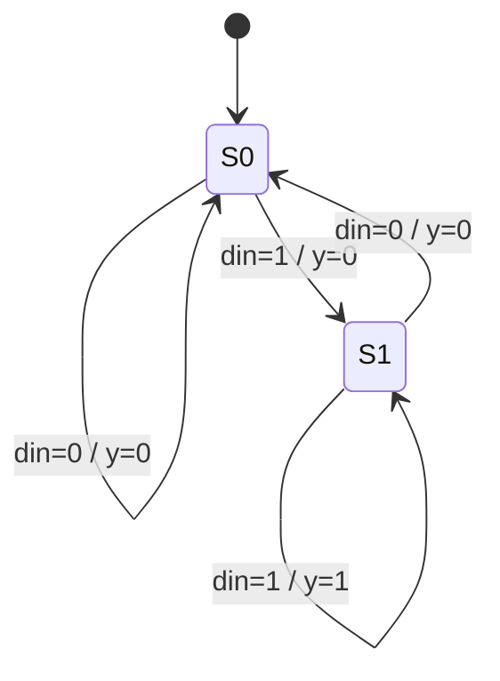

# Mealy detector "11"

**Difficulty:** ⭐⭐⭐ · **Topics:** Mealy vs Moore

## Background
A **Mealy** machine's output depends on the current state **and** the current
input, so it can respond a cycle earlier than an equivalent Moore machine — at the
cost of being combinational (and thus able to glitch). Comparing this "two 1s in a
row" detector with the Moore machine in problem 0028 is the clearest way to feel
the difference.

## The task
Assert `y` in the *same* cycle when the current and previous `din` are both 1
(overlapping).

## Interface
| Port | Dir | Width | Description |
|------|-----|-------|-------------|
| `clk`, `rst_n` | input | 1 | clock / async reset |
| `din` | input  | 1 | serial data |
| `y`   | output | 1 | Mealy output (combinational) |



## How to approach it
One state bit is enough — "was the previous bit a 1?".
```systemverilog
typedef enum logic {S0, S1} state_e;
state_e state;
always_ff @(posedge clk or negedge rst_n)
    if (!rst_n) state <= S0;
    else        state <= din ? S1 : S0;
assign y = (state == S1) & din;   // reacts to din immediately (Mealy)
```

## Common mistakes
- Registering `y` — that would make it Moore (one cycle late).
- Forgetting the `& din`, which is the "current input" half of a Mealy output.

## SystemVerilog notes
Because Mealy outputs are combinational, be careful when they feed other logic —
they can glitch mid-cycle. Register them if a downstream block needs a clean pulse.

## Run it
```bash
iverilog -g2012 -s tb -o sim 0029/tb.sv 0029/solution.sv && vvp sim
```
