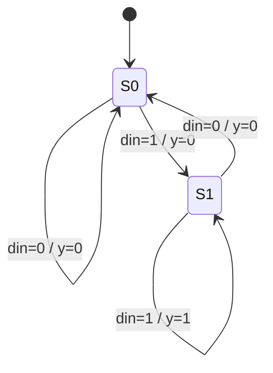

# Mealy detector "11"

**Difficulty:** ⭐⭐⭐ · **Topics:** Mealy vs Moore

## Learning objective
Contrast a **Mealy** machine (output depends on state *and* input) with the Moore
style of the previous problem.

## Problem
Assert `y` in the *same* cycle when the current `din` and the previous `din` are
both 1 (two consecutive 1s, overlapping).

## Interface
| Port | Dir | Width | Description |
|------|-----|-------|-------------|
| `clk`, `rst_n` | input | 1 | clock / async reset |
| `din` | input  | 1 | serial data |
| `y`   | output | 1 | Mealy output (combinational) |

## Hints
- One state bit is enough: was the previous bit a 1?
- `y = (state == S1) & din;` — note the output reacts to `din` immediately.

## SystemVerilog notes
Mealy outputs can respond one cycle earlier than Moore but are combinational, so
they can glitch — keep that in mind when they feed other logic.
