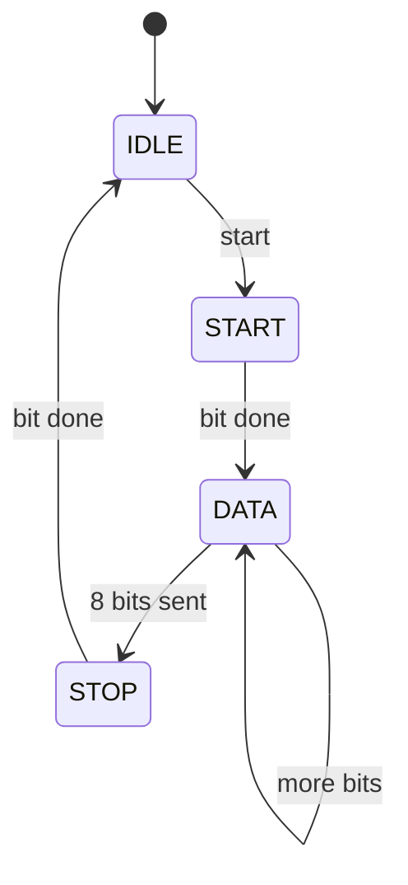

# Finite state machine (UART transmitter, hero)

**Difficulty:** ⭐⭐⭐⭐⭐ · **Topics:** FSM + datapath, serialization, timing

## Background
This is the capstone: it ties together an FSM, counters, and a shift of data to
send a byte over a serial line in the classic **8-N-1** UART format. The line
idles high; a frame is a `start` bit (0), then 8 data bits **LSB first**, then a
`stop` bit (1). Each bit is held for `CLKS_PER_BIT` clocks — that baud counter is
what turns a fast clock into a slow bit stream.

The clean way to structure it: a small **control** FSM (IDLE → START → DATA →
STOP) plus two counters (a baud counter and a bit index), and simple
**combinational output shaping** that drives `tx`/`busy` from the state.

## The task
On a `start` pulse (when idle), latch `data` and transmit the frame; `busy` is
high throughout.

```
frame:  start | d0 d1 d2 d3 d4 d5 d6 d7 | stop
level:    0   |        data bits        |  1
```

## Interface
| Port | Dir | Width | Description |
|------|-----|-------|-------------|
| `clk`, `rst_n` | input | 1 | clock / async reset |
| `start` | input  | 1 | begin transmission (1-cycle pulse) |
| `data`  | input  | 8 | byte to send |
| `tx`    | output | 1 | serial line |
| `busy`  | output | 1 | transmitting |

**Parameter:** `CLKS_PER_BIT` (default 8)



## How to approach it
1. **State + counters** in `always_ff`: `clk_cnt` (0..CLKS_PER_BIT-1) times each
   bit; when it wraps, advance `bit_idx` (in DATA) or change state.
2. **Outputs** combinationally: `tx = 0` in START, `tx = shreg[bit_idx]` in DATA,
   else `1`; `busy = (state != IDLE)`.
3. Latch `data` into a shift/holding register when leaving IDLE, and send
   `shreg[bit_idx]` so bit 0 goes out first.

## Common mistakes
- Sending MSB first (UART is **LSB first**).
- Off-by-one bit timing — each phase must last exactly `CLKS_PER_BIT` clocks.
- Mixing control and output into one tangled block; splitting them (sequential
  control, combinational `tx`/`busy`) keeps it verifiable.

## How the testbench checks it
The provided `tb.sv` acts as a **UART receiver**: it waits for the start bit,
samples each bit at mid-period (every `CLKS_PER_BIT` clocks), reconstructs the
byte, and checks it matches what was sent — plus valid start/stop framing.
