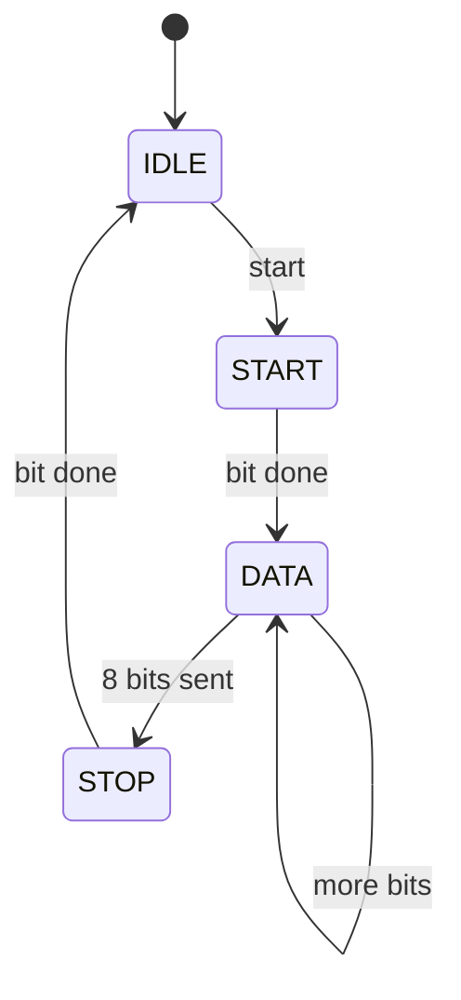

# UART transmitter (hero)

**Difficulty:** ⭐⭐⭐⭐⭐ · **Topics:** FSM + datapath, serialization, timing

## Learning objective
Combine everything: an `enum` FSM, a bit counter, a baud counter and a shift of
data to serialize a byte as a standard **8-N-1** UART frame.

## Problem
When `start` pulses (and the transmitter is idle), latch `data` and send:
`start bit (0)` → 8 data bits **LSB first** → `stop bit (1)`.
Each bit lasts `CLKS_PER_BIT` clocks. `tx` idles high; `busy` is high for the
whole frame.

```
frame:  start | d0 d1 d2 d3 d4 d5 d6 d7 | stop
level:    0   |        data bits        |  1
```

## Interface
| Port | Dir | Width | Description |
|------|-----|-------|-------------|
| `clk`, `rst_n` | input | 1 | clock / async reset |
| `start` | input  | 1 | begin transmission (1-cycle pulse) |
| `data`  | input  | 8 | byte to send |
| `tx`    | output | 1 | serial line |
| `busy`  | output | 1 | transmitting |

**Parameter:** `CLKS_PER_BIT` (default 8)



## Hints
- Keep `clk_cnt` (0..CLKS_PER_BIT-1) for bit timing and `bit_idx` (0..7).
- Drive `tx`/`busy` combinationally from the state; keep the counters in the
  `always_ff`. `tx = shreg[bit_idx]` during DATA.

## SystemVerilog notes
Splitting *control* (the FSM/counters, sequential) from *output shaping*
(`tx`/`busy`, combinational) keeps each block simple and easy to verify — the
same style you saw in the earlier FSM problems.
