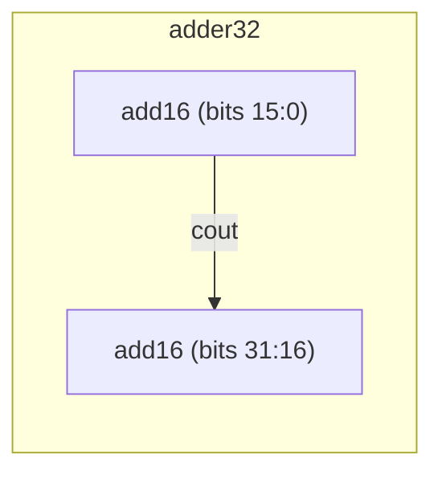

# Module instantiation (hierarchical adder)

**Difficulty:** ⭐⭐⭐ · **Topics:** hierarchy, carry chaining across instances

## Background
Large arithmetic is built by connecting smaller blocks and **chaining the carry**.
Given a 16-bit adder, a 32-bit adder is just two of them: the low adder's `cout`
feeds the high adder's `cin`. This is the essence of hierarchical design — reuse a
proven block instead of re-deriving the logic.

## The task
`add16` is **provided in `tb.sv`**. Build `adder32` that computes `sum = a + b`
(32-bit) by instantiating two `add16` and rippling the carry.

### Sub-module you must instantiate
```systemverilog
module add16 (input [15:0] a, input [15:0] b, input cin,
              output [15:0] sum, output cout);
```

## Interface (your module)
| Port | Dir | Width | Description |
|------|-----|-------|-------------|
| `a`, `b` | input  | 32 | operands |
| `sum`    | output | 32 | a + b (low 32 bits) |



## How to approach it
```systemverilog
logic carry;
add16 u_lo (.a(a[15:0]),  .b(b[15:0]),  .cin(1'b0),  .sum(sum[15:0]),  .cout(carry));
add16 u_hi (.a(a[31:16]), .b(b[31:16]), .cin(carry), .sum(sum[31:16]), .cout());
```
Leaving `.cout()` unconnected on the high adder is fine — the final carry is not
needed here.

## Common mistakes
- Not chaining the carry (using `1'b0` for the high adder's `cin`).
- Splitting the 32-bit buses on the wrong bit boundaries.
