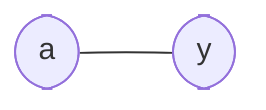

# Wire

**Difficulty:** ⭐ (Getting started) · **Topics:** entity/architecture, `signal`, concurrent assignment

## Learning objective
Write your first VHDL `entity` + `architecture` and connect an input to an
output with a concurrent signal assignment.

## Problem
Build `wire_passthrough`: the output `y` always equals the input `a`.

> Note: in VHDL `in` and `out` are reserved keywords (port *directions*), so the
> data ports are named `a` and `y`.

## Interface
| Port | Dir | Type | Description |
|------|-----|------|-------------|
| `a` | in  | std_logic | source |
| `y` | out | std_logic | copy of `a` |

## Hints
- A concurrent assignment `y <= a;` lives directly in the architecture body.

## VHDL notes
`std_logic` (from `ieee.std_logic_1164`) is the 9-value logic type used for
synthesis. `<=` is *signal* assignment; `:=` is *variable* assignment.
