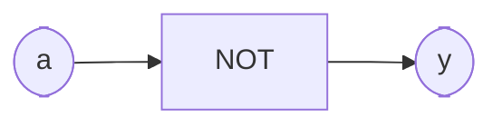

# Inverter (NOT)

**Difficulty:** ⭐ · **Topics:** logical `not`

## Background
The inverter flips a bit. VHDL spells the operator as the keyword `not`. VHDL is
strongly typed and gives every logic operation a keyword (`not`, `and`, `or`,
`xor`, `nand`, `nor`, `xnor`) — which is also why you cannot name a signal `and`.

## The task
`y = not a`.

## Interface
| Port | Dir | Type | Description |
|------|-----|------|-------------|
| `a` | in  | std_logic | source |
| `y` | out | std_logic | inverted source |



## Truth table
| a | y |
|---|---|
| 0 | 1 |
| 1 | 0 |

## How to approach it
```vhdl
y <= not a;
```

## Common mistakes
- Trying `~a` (that is Verilog/C, not VHDL). VHDL uses the word `not`.

## VHDL notes
The same operators work on `std_logic_vector` element-by-element, so
`not "1010"` is `"0101"`.

## Run it (GHDL)
```bash
# from track/vhdl_zero2hero/
ghdl -a --std=08 0002/solution.vhdl 0002/tb.vhdl && ghdl -e --std=08 tb && ghdl -r --std=08 tb
```
A correct run prints `Test PASS`. Swap `solution.vhdl` for `interface.vhdl` to test
your own answer.
