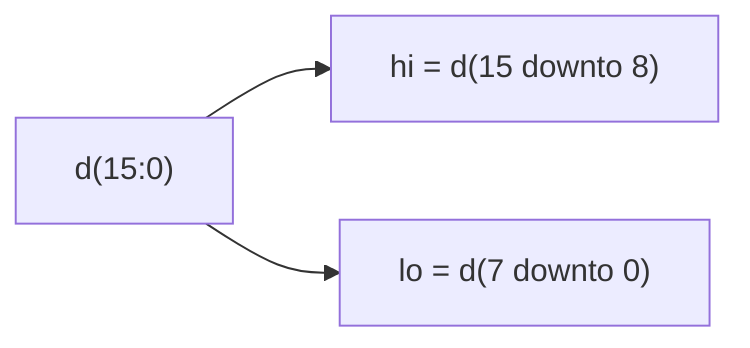

# Vectors (slicing with downto)

**Difficulty:** ⭐ · **Topics:** `std_logic_vector`, slicing with `downto`

## Background
A **vector** bundles wires into one multi-bit signal: `std_logic_vector(15 downto 0)`
is 16 bits, index 15 (MSB) down to 0 (LSB). A **slice** `d(hi downto lo)` grabs a
contiguous field — the everyday way to break a word into parts (e.g. an address
into tag/index/offset).

## The task
Split a 16-bit word into upper and lower bytes.

## Interface
| Port | Dir | Type | Description |
|------|-----|------|-------------|
| `d`  | in  | std_logic_vector(15 downto 0) | packed word |
| `hi` | out | std_logic_vector(7 downto 0)  | `d(15 downto 8)` |
| `lo` | out | std_logic_vector(7 downto 0)  | `d(7 downto 0)` |



## How to approach it
```vhdl
hi <= d(15 downto 8);
lo <= d(7 downto 0);
```

## Common mistakes
- Using `to` instead of `downto` (must match the declaration's direction).
- Width mismatch: an 8-bit port needs an 8-bit slice.

## VHDL notes
Slice direction must follow the signal's declared direction. `downto` is the usual
convention for numeric vectors.
