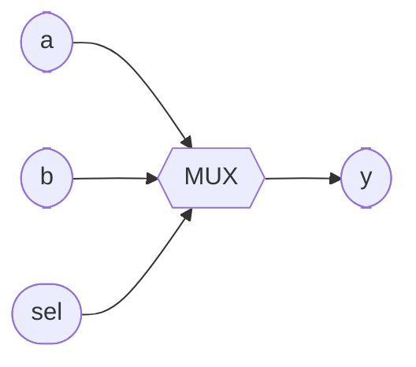

# 2-to-1 Multiplexer

**Difficulty:** ⭐⭐ · **Topics:** conditional signal assignment

## Background
A **multiplexer** is a controlled switch: `sel` chooses which input reaches the
output. It is the most common datapath element — every "choose A or B" is a mux.
VHDL's **conditional signal assignment** (`... when ... else ...`) reads like the
truth table.

## The task
`sel='0'` selects `a`; `sel='1'` selects `b`.

## Interface
| Port | Dir | Type | Description |
|------|-----|------|-------------|
| `a`   | in  | std_logic | data 0 |
| `b`   | in  | std_logic | data 1 |
| `sel` | in  | std_logic | select |
| `y`   | out | std_logic | selected data |



## How to approach it
```vhdl
y <= b when sel = '1' else a;
```

## Common mistakes
- Comparing with `=` in the condition (VHDL uses `=` for equality, not `==`).
- Swapping the branches and selecting the wrong input.

## VHDL notes
The same form widens to buses (`y <= b_bus when sel = '1' else a_bus;`) and chains
for bigger muxes, though a `case` in a process is clearer past two inputs
(problem 0013).

## Run it (GHDL)
```bash
# from track/vhdl_zero2hero/
ghdl -a --std=08 0004/solution.vhdl 0004/tb.vhdl && ghdl -e --std=08 tb && ghdl -r --std=08 tb
```
A correct run prints `Test PASS`. Swap `solution.vhdl` for `interface.vhdl` to test
your own answer.
