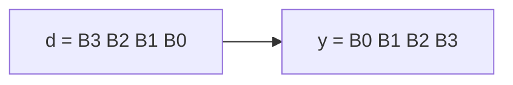

# Byte reverse (array type)

**Difficulty:** ⭐⭐ · **Topics:** array `type`, byte addressing

## Background
VHDL lets you define your own **array types**. An
`array(0 to 3) of std_logic_vector(7 downto 0)` is four separate byte elements —
the VHDL analogue of an "unpacked array", as opposed to one wide vector. Here you
use such an array as scratch storage to reorder bytes.

## The task
Reverse the **byte** order of a 32-bit word:
`y = d(7 downto 0) & d(15 downto 8) & d(23 downto 16) & d(31 downto 24)`.

## Interface
| Port | Dir | Type | Description |
|------|-----|------|-------------|
| `d` | in  | std_logic_vector(31 downto 0) | packed word |
| `y` | out | std_logic_vector(31 downto 0) | byte-swapped |



## How to approach it
Declare the type, split into bytes, then write them back reversed:
```vhdl
type byte_arr is array(0 to 3) of std_logic_vector(7 downto 0);
...
process(d)
    variable b : byte_arr;
begin
    for i in 0 to 3 loop b(i) := d(i*8 + 7 downto i*8); end loop;
    for i in 0 to 3 loop y(i*8 + 7 downto i*8) <= b(3 - i); end loop;
end process;
```

## Common mistakes
- Confusing byte-reverse (whole 8-bit groups move) with bit-reverse (problem 0008).
- Using `:=` vs `<=`: the `variable b` uses `:=`, the signal/port `y` uses `<=`.

## VHDL notes
Array types model memories and register files. A `variable` inside a process
updates immediately (unlike a signal), which is why `b` is filled then read within
the same process.

## Run it (GHDL)
```bash
# from track/vhdl_zero2hero/
ghdl -a --std=08 0009/solution.vhdl 0009/tb.vhdl && ghdl -e --std=08 tb && ghdl -r --std=08 tb
```
A correct run prints `Test PASS`. Swap `solution.vhdl` for `interface.vhdl` to test
your own answer.
