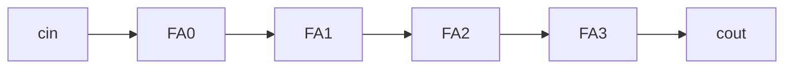

# Ripple-carry adder (for-generate)

**Difficulty:** ⭐⭐⭐ · **Topics:** `generic`, `for ... generate`, carry chain

## Background
To add `WIDTH`-bit numbers, chain `WIDTH` full adders and let the carry "ripple"
up. Rather than copy stages, use a **`for ... generate`**, which the tool unrolls
into that many stages at elaboration. The width is a **`generic`**, so one
description scales to any size.

## The task
Add two `WIDTH`-bit numbers plus `cin`, giving `sum` and `cout`, from a generated
carry chain.

## Interface
| Port | Dir | Type | Description |
|------|-----|------|-------------|
| `a`, `b` | in  | std_logic_vector(WIDTH-1 downto 0) | operands |
| `cin`    | in  | std_logic | carry in |
| `sum`    | out | std_logic_vector(WIDTH-1 downto 0) | result |
| `cout`   | out | std_logic | carry out |

**Generic:** `WIDTH` (default 4)



## How to approach it
Use an internal `carry` vector one bit wider than the operands:
```vhdl
signal carry : std_logic_vector(WIDTH downto 0);
...
carry(0) <= cin;
gen_stage : for i in 0 to WIDTH-1 generate
    sum(i)     <= a(i) xor b(i) xor carry(i);
    carry(i+1) <= (a(i) and b(i)) or (a(i) and carry(i)) or (b(i) and carry(i));
end generate;
cout <= carry(WIDTH);
```

## Common mistakes
- Forgetting the extra carry bit (`carry` must be `WIDTH+1` long).
- Using a process `for` loop where structural `for ... generate` is intended.

## VHDL notes
`generate` elaborates structure, so the bound must be constant/generic. The label
`gen_stage` names the generated instances in the hierarchy.

## Run it (GHDL)
```bash
ghdl -a --std=08 0012/solution.vhdl 0012/tb.vhdl && ghdl -e --std=08 tb && ghdl -r --std=08 tb
```
