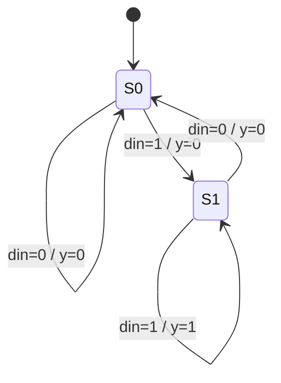

# Finite state machine (Mealy detector)

**Difficulty:** ⭐⭐⭐ · **Topics:** Mealy vs Moore

## Background
A **Mealy** machine's output depends on the state **and** the current input, so it
can react a cycle earlier than a Moore machine — at the cost of being
combinational (and able to glitch). Compare this "two 1s in a row" detector with
the Moore FSM in 0028.

## The task
Assert `y` in the *same* cycle when the current and previous `din` are both 1
(overlapping).

## Interface
| Port | Dir | Type | Description |
|------|-----|------|-------------|
| `clk`, `rst_n` | in | std_logic | clock / async reset |
| `din` | in  | std_logic | serial data |
| `y`   | out | std_logic | Mealy output (combinational) |



## How to approach it
One state bit ("was the previous bit a 1?"):
```vhdl
type state_t is (S0, S1);
signal state : state_t;
...
process(clk, rst_n)
begin
    if rst_n = '0' then state <= S0;
    elsif rising_edge(clk) then
        if din = '1' then state <= S1; else state <= S0; end if;
    end if;
end process;
y <= '1' when (state = S1 and din = '1') else '0';   -- reacts to din now
```

## Common mistakes
- Registering `y` (that makes it Moore, a cycle late).
- Dropping the `and din` term (the "current input" half of a Mealy output).

## VHDL notes
Mealy outputs are combinational and can glitch — register them if a downstream
block needs a clean pulse.
