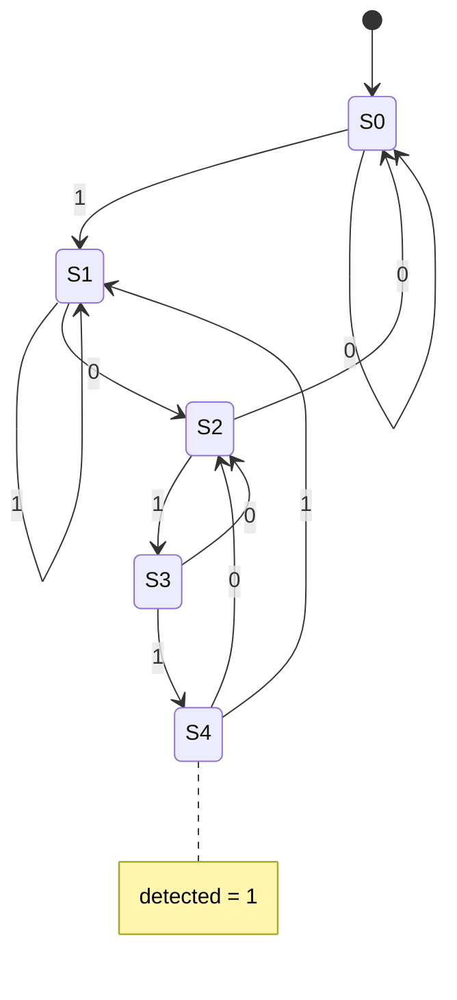

# Sequence detector "1011" (Moore FSM)

**Difficulty:** ⭐⭐⭐⭐ · **Topics:** enumerated state type, Moore output, overlap

## Problem
Serial `din` arrives one bit per clock. Assert `detected` for one cycle whenever
the last four bits form `1011` (overlaps allowed). Moore output: depends only on
the state.

## Interface
| Port | Dir | Type | Description |
|------|-----|------|-------------|
| `clk`, `rst_n` | in | std_logic | clock / async reset |
| `din`      | in  | std_logic | serial data |
| `detected` | out | std_logic | pattern seen |

## VHDL notes
`type state_t is (S0, S1, S2, S3, S4);` gives readable state names in the
waveform. Register `state`, and drive `detected` from `state` combinationally.
