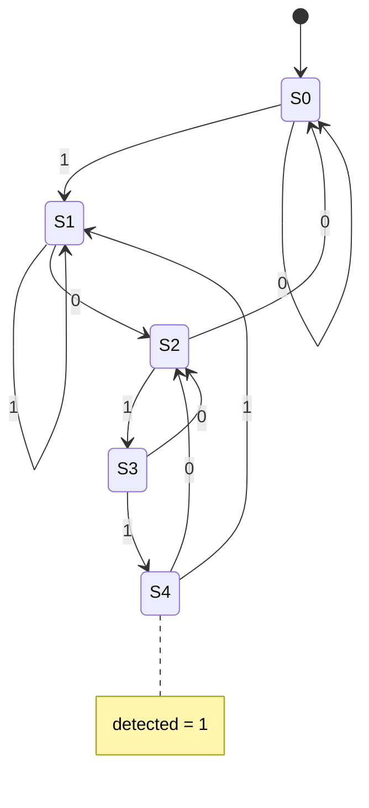

# Sequence detector "1011" (Moore FSM)

**Difficulty:** ⭐⭐⭐⭐ · **Topics:** enumerated state type, Moore output, overlap

## Background
A **finite state machine** tracks "how far along a pattern we are". Each clock it
consumes one input bit and moves between named states; at the accepting state it
flags a match. This is a **Moore** machine — the output depends only on the state,
so `detected` is clean. We allow **overlap** (`1011011` fires twice): from the
accepting state the trailing `1` also begins a fresh match.

## The task
Assert `detected` for one cycle whenever the last four serial bits equal `1011`.

## Interface
| Port | Dir | Type | Description |
|------|-----|------|-------------|
| `clk`, `rst_n` | in | std_logic | clock / async reset |
| `din`      | in  | std_logic | serial data |
| `detected` | out | std_logic | pattern seen |



## How to approach it
```vhdl
type state_t is (S0, S1, S2, S3, S4);
signal state : state_t;
...
process(clk, rst_n)
begin
    if rst_n = '0' then state <= S0;
    elsif rising_edge(clk) then
        case state is
            when S0 => if din='1' then state<=S1; else state<=S0; end if;
            -- ...
            when S4 => if din='1' then state<=S1; else state<=S2; end if;  -- overlap
        end case;
    end if;
end process;
detected <= '1' when state = S4 else '0';
```

## Common mistakes
- Wrong overlap transitions from the accepting state.
- Making `detected` depend on `din` (that would be Mealy).

## VHDL notes
An enumerated `state_t` shows readable state names in the waveform and lets the
tool catch illegal state values.

## Run it (GHDL)
```bash
ghdl -a --std=08 0028/solution.vhdl 0028/tb.vhdl && ghdl -e --std=08 tb && ghdl -r --std=08 tb
```
