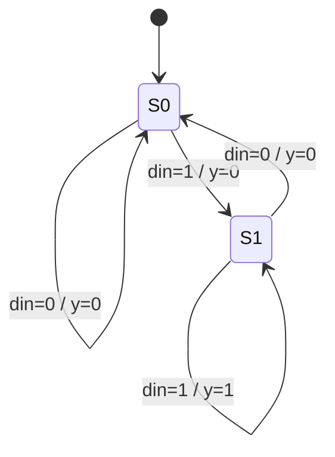

# Mealy detector "11"

**Difficulty:** ⭐⭐⭐ · **Topics:** Mealy vs Moore

## Problem
Assert `y` in the *same* cycle when the current `din` and the previous `din` are
both 1 (overlapping). Mealy: output depends on state **and** input.

## Interface
| Port | Dir | Type | Description |
|------|-----|------|-------------|
| `clk`, `rst_n` | in | std_logic | clock / async reset |
| `din` | in  | std_logic | serial data |
| `y`   | out | std_logic | Mealy output (combinational) |

## VHDL notes
One state bit is enough (was the last bit a 1?). `y <= '1' when state = S1 and
din = '1' else '0';` reacts to `din` immediately — the Mealy hallmark.
