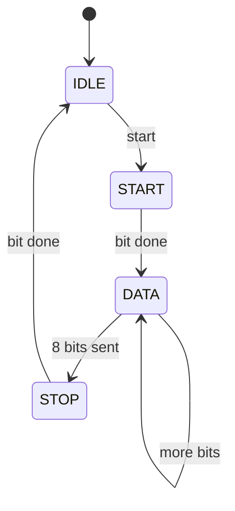

# UART transmitter (hero)

**Difficulty:** ⭐⭐⭐⭐⭐ · **Topics:** FSM + datapath, serialization, timing

## Problem
When `start` pulses (idle), latch `data` and send an 8-N-1 frame:
`start bit (0)` -> 8 data bits **LSB first** -> `stop bit (1)`. Each bit lasts
`CLKS_PER_BIT` clocks. `tx` idles high; `busy` is high for the whole frame.

```
frame:  start | d0 d1 d2 d3 d4 d5 d6 d7 | stop
level:    0   |        data bits        |  1
```

## Interface
| Port | Dir | Type | Description |
|------|-----|------|-------------|
| `clk`, `rst_n` | in | std_logic | clock / async reset |
| `start` | in  | std_logic | begin (1-cycle pulse) |
| `data`  | in  | std_logic_vector(7 downto 0) | byte |
| `tx`    | out | std_logic | serial line |
| `busy`  | out | std_logic | transmitting |

**Generic:** `CLKS_PER_BIT` (default 8)



## VHDL notes
Keep the FSM + counters in a clocked `process`; drive `tx`/`busy` with concurrent
`when/else` from the state. `tx <= shreg(bit_idx)` during DATA sends LSB first.
