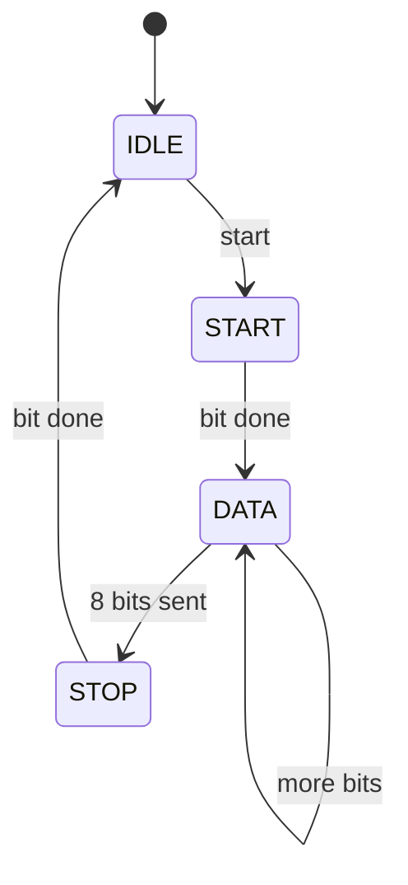

# UART transmitter (hero)

**Difficulty:** ⭐⭐⭐⭐⭐ · **Topics:** FSM + datapath, serialization, timing

## Background
The capstone ties an FSM, counters, and data selection together to send a byte in
the classic **8-N-1** UART format. The line idles high; a frame is a `start` bit
(0), then 8 data bits **LSB first**, then a `stop` bit (1). Each bit lasts
`CLKS_PER_BIT` clocks — the baud counter that turns a fast clock into a slow bit
stream. Structure it as a small **control** FSM (IDLE → START → DATA → STOP) plus
two counters, with **combinational output shaping** for `tx`/`busy`.

## The task
On a `start` pulse (when idle), latch `data` and transmit the frame; `busy` high
throughout.

```
frame:  start | d0 d1 d2 d3 d4 d5 d6 d7 | stop
level:    0   |        data bits        |  1
```

## Interface
| Port | Dir | Type | Description |
|------|-----|------|-------------|
| `clk`, `rst_n` | in | std_logic | clock / async reset |
| `start` | in  | std_logic | begin (1-cycle pulse) |
| `data`  | in  | std_logic_vector(7 downto 0) | byte |
| `tx`    | out | std_logic | serial line |
| `busy`  | out | std_logic | transmitting |

**Generic:** `CLKS_PER_BIT` (default 8)



## How to approach it
1. **State + counters** in a clocked process: `clk_cnt` (0..CLKS_PER_BIT-1) times
   each bit; when it wraps, advance `bit_idx` (in DATA) or change state.
2. **Outputs** with concurrent `when/else`: `tx='0'` in START, `shreg(bit_idx)` in
   DATA, else `'1'`; `busy <= '0' when state=IDLE else '1'`.
3. Latch `data` into `shreg` on leaving IDLE and send `shreg(bit_idx)` so bit 0
   goes first.

## Common mistakes
- Sending MSB first (UART is **LSB first**).
- Off-by-one bit timing — each phase lasts exactly `CLKS_PER_BIT` clocks.
- Tangling control and outputs into one block; keep control sequential and
  `tx`/`busy` combinational.

## How the testbench checks it
`tb.vhdl` acts as a **UART receiver**: it waits for the start bit, samples each
bit at mid-period (every `CLKS_PER_BIT` clocks), rebuilds the byte, and checks it
matches — plus valid start/stop framing.

## Run it (GHDL)
```bash
ghdl -a --std=08 0031/solution.vhdl 0031/tb.vhdl && ghdl -e --std=08 tb && ghdl -r --std=08 tb
```

Finishing this means you have combined essentially every core building block in
the track into one design. Well done.
