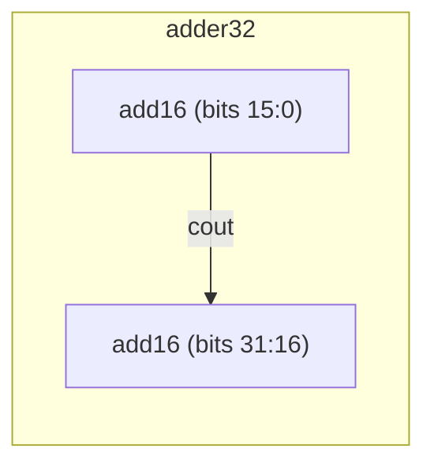

# Component instantiation (hierarchical adder)

**Difficulty:** ⭐⭐⭐ · **Topics:** hierarchy, carry chaining across instances

## Background
Large arithmetic is built by connecting smaller blocks and **chaining the carry**.
Given a 16-bit adder, a 32-bit adder is just two of them: the low adder's `cout`
feeds the high adder's `cin`. This is the essence of hierarchical design — reuse a
proven block instead of re-deriving the logic.

## The task
`add16` is **provided in `tb.vhdl`**. Build `adder32` that computes `sum = a + b`
(32-bit) by instantiating two `add16` and rippling the carry.

### Sub-entity you must instantiate
```vhdl
entity add16 port (a, b : in  std_logic_vector(15 downto 0);
                   cin  : in  std_logic;
                   sum  : out std_logic_vector(15 downto 0);
                   cout : out std_logic);
```

## Interface (your entity)
| Port | Dir | Type | Description |
|------|-----|------|-------------|
| `a`, `b` | in  | std_logic_vector(31:0) | operands |
| `sum`    | out | std_logic_vector(31:0) | a + b (low 32 bits) |



## How to approach it
```vhdl
signal carry : std_logic;
...
u_lo : add16 port map (a => a(15 downto 0),  b => b(15 downto 0),
                       cin => '0', sum => sum(15 downto 0), cout => carry);
u_hi : add16 port map (a => a(31 downto 16), b => b(31 downto 16),
                       cin => carry, sum => sum(31 downto 16), cout => open);
```
Associating the high adder's `cout` with `open` is fine — the final carry is not
needed here.

## Common mistakes
- Not chaining the carry (using `'0'` for the high adder's `cin`).
- Slicing the 32-bit vectors on the wrong bit boundaries.
